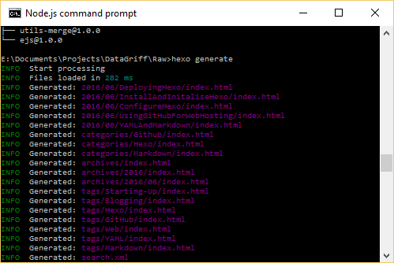
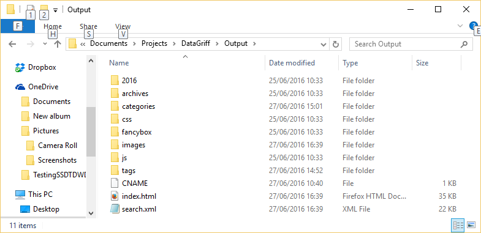
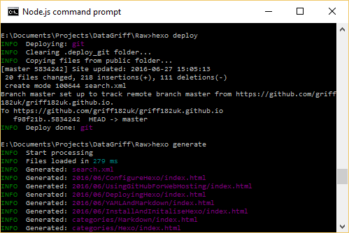

## Generating the Files

When in node.js command prompt, navigate to your source folder where you initialised hexo, and type
```
hexo generate
```
This will deploy all the html files to the output path you designated in the \_config.yml file.



In my case I'd configured the files to generate in a folder above the source folder called outputs (../Output was what I had in the \_config.yml file).



## Deploying Hexo

I chose to use git for my hexo deployment so before you can use the hexo deploy command below, you first need to install this. To install git deployment, while in the hexo initalised folder, type the following command and press return.
```
npm install hexo-deployer-git --save
```
You also need to ensure that in your \_config.yml file that you have git specified as the deploy method and the name of your github io repository specified.
To deploy then, when in node.js command prompt, navigate to your source folder where you initialised hexo, and type
```
hexo deploy
```
This will deploy and push the files to the github repo you specified in the \_config.yml file.


